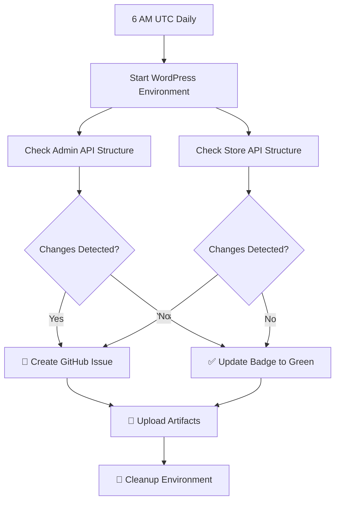

# WooCommerce API Monitoring Setup Summary

## 🎯 What Was Implemented

### 1. **Enhanced Daily Monitoring Workflow**

- **Schedule**: Changed from 2 AM to **6 AM UTC daily**
- **Coverage**: Now monitors **both Admin API and Store API**
- **File**: `.github/workflows/wc-admin-api-monitor.yml`

### 2. **Dual API Structure Monitoring**

| **API Type**  | **Endpoint**           | **Purpose**            | **Services**                                |
| ------------- | ---------------------- | ---------------------- | ------------------------------------------- |
| **Admin API** | `/wp-json/wc/v3`       | WooCommerce management | Products, Orders, Customers, Settings, etc. |
| **Store API** | `/wp-json/wc/store/v1` | Storefront operations  | Cart, Checkout, Product catalog             |

### 3. **Status Badges in README**

Added two monitoring badges showing API sync status:

```markdown


```

## 🔄 Workflow Features

### **Automated Detection**

- ✅ **New endpoints** added to APIs
- ✅ **Removed endpoints** (breaking changes)
- ✅ **Parameter changes** in existing endpoints
- ✅ **Method changes** (GET, POST, PUT, DELETE)

### **Smart Issue Creation**

- 🚨 **Auto-creates GitHub issues** when changes detected
- 📊 **Detailed change reports** with specific modifications
- 🏷️ **Auto-labels issues** as `api-monitoring`, `auto-generated`
- 🔴 **Critical labels** for breaking changes

### **PR Integration**

- 💬 **Auto-comments on PRs** when API changes detected
- 🔍 **Links to workflow results** for detailed analysis

## 📊 Badge Status Meanings

| **Badge Color** | **Status** | **Meaning**                                |
| --------------- | ---------- | ------------------------------------------ |
| 🟢 **Green**    | ✅ Passing | APIs are in sync with SDK                  |
| 🔴 **Red**      | ❌ Failing | API changes detected, SDK may need updates |
| 🟡 **Yellow**   | ⚠️ Running | Monitoring workflow currently running      |

## 🚀 Daily Monitoring Flow



## 📁 Workflow Outputs

### **Artifacts Generated**

- 📸 **API Structure Snapshots** (30-day retention)
- 📊 **Change Reports** with detailed differences
- 🗂️ **Baseline Updates** when APIs change

### **GitHub Integration**

- 🎫 **Auto-generated issues** for API changes
- 💬 **PR comments** when changes affect pull requests
- 📈 **Workflow status badges** in README

## 🎯 Benefits

1. **Early Detection**: Catch API breaking changes before they affect users
2. **Automated Monitoring**: No manual intervention needed for daily checks
3. **Visual Status**: README badges show API compatibility at a glance
4. **Detailed Reporting**: Full change reports available as workflow artifacts
5. **GitHub Integration**: Automatic issue creation and PR notifications
6. **Historical Tracking**: 30-day artifact retention for change analysis

## 🔧 Manual Operations

### **Update Baselines** (after handling changes)

```bash
# Update Admin API baseline
npm run api:monitor:admin:create

# Update Store API baseline
npm run api:monitor:store:create
```

### **Manual Comparison**

```bash
# Compare Admin API
npm run api:monitor:admin:compare

# Compare Store API
npm run api:monitor:store:compare
```

---

## ✅ Setup Complete!

Your WooCommerce API monitoring is now fully configured with:

- 🕕 **Daily monitoring at 6 AM UTC**
- 🔄 **Dual API coverage** (Admin + Store)
- 📊 **Status badges** in README
- 🚨 **Automatic issue creation**
- 📁 **Comprehensive reporting**

The next scheduled run will occur at **6 AM UTC** and will monitor both APIs automatically! 🎉
